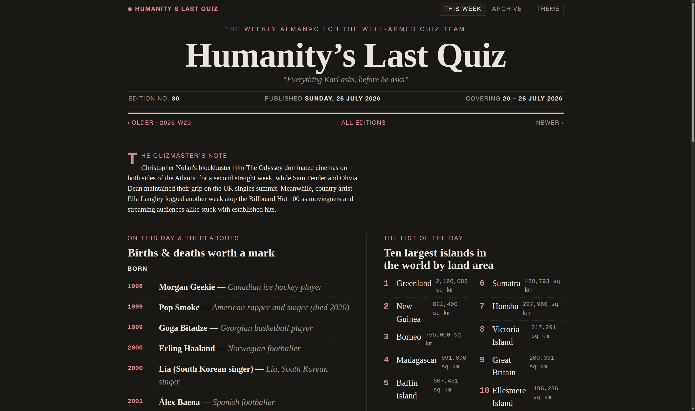

# Humanity's Last Quiz



> *"Everything Karl asks, before he asks"*

A **weekly broadsheet almanac** that pre-loads a pub-quiz team with the facts their quiz reliably asks about. A fresh edition is generated every Sunday covering the week just gone, with a browsable archive of past weeks — rendered as a static site and published to GitHub Pages.

**Live:** https://temataro.github.io/humanitys-last-quiz/

## What's in an edition

- **On this day** — births & deaths of notable figures across the week (from Wikipedia)
- **The charts** — UK & US #1 singles and albums, plus the safe "#1 artist" banker
- **The picture house** — box office
- **The list of the day** — a rotating Top-10 (largest countries, biggest economies, …)
- **Starters for ten** — trivia, geography facts, and this-week-in-chart-history

Every fact carries its source; the footer credits are generated from what was actually used.

## How it works

```
build  →  Wikipedia + aggregator (Gemini web search → free sources → placeholder)  →  data/weeks/<week>.json
render →  data/weeks/*.json  →  templates/ (Jinja2)  →  site/ (static HTML)
```

Data is sourced authoritatively and split by hallucination risk: exact dates (births/deaths) always come from Wikipedia, never an LLM. The rest is filled by a single grounded Gemini prompt when a key is configured, falling back to free keyless sources (Billboard Hot 100, World Bank, Open Trivia DB) otherwise — so an edition always builds, with or without an API key.

## Quickstart

```bash
make setup     # one-time: virtualenv + dependencies
make all       # build the latest week + render the site
make serve     # preview at http://localhost:8000
```

No API key is required. For grounded LLM coverage, set `GEMINI_API_KEY` (a billing-enabled Google project) in a local `.env` — see `.env.example` on the `no-llm-provenance` branch, or `CLAUDE.md`.

## Automation

`.github/workflows/weekly.yml` rebuilds every Sunday (07:00 UTC) and redeploys `site/` to GitHub Pages on every push to `main`. Enable Pages under **Settings → Pages → Source: GitHub Actions**. For grounded editions in CI, add a `GEMINI_API_KEY` **Actions secret** (optional).

## Branches

- **`main`** — Gemini primary, free sources as fallback.
- **`no-llm-provenance`** — the pure keyless, no-LLM pipeline (every fact from a free structured source).

## Sources & licenses

Wikipedia "On this day" (CC BY-SA) · Billboard Hot 100 · World Bank (CC BY) · Open Trivia DB (CC BY-SA) · officialcharts.com / Box Office Mojo / BFI (via grounded search). Built with an AI coding assistant.
